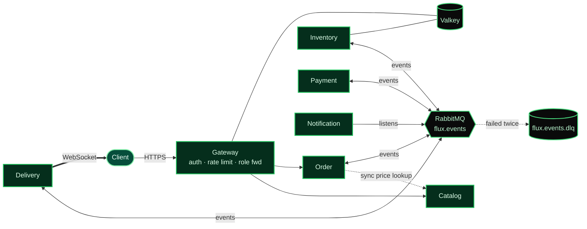
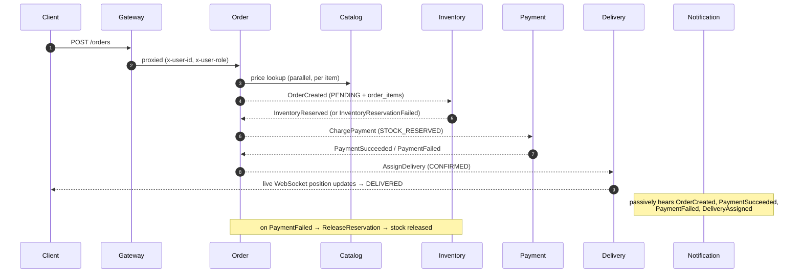

<a id="top"></a>
<div align="center">


<br/><br/>


<br/>

**[Architecture](#architecture)** · **[Quick Start](#quick-start)** · **[Proof](#proof-not-claims)** · **[Services](#services)** · **[Roadmap](#roadmap)** · **[ADRs](#architecture-decisions)**

<br/>

<table>
  <tr>
    <td align="center" width="160"><h2>7</h2><sub>independent<br/>services</sub></td>
    <td align="center" width="160"><h2>70</h2><sub>automated<br/>tests</sub></td>
    <td align="center" width="160"><h2>76</h2><sub>spans in one<br/>connected trace</sub></td>
    <td align="center" width="160"><h2>1 / 100</h2><sub>oversell-proof<br/>under load</sub></td>
    <td align="center" width="160"><h2>0</h2><sub>shared<br/>databases</sub></td>
  </tr>
</table>

</div>

---

**Flux is a quick-commerce backend built as seven independent services with no shared database.** It models the problems that make order systems hard: reserving stock under concurrency, coordinating services through events, recovering when a step fails, and routing deliveries, and it backs each claim with a test, a load run, or a trace.

<!--
  TODO (add before applying):
  - Live demo: Gateway URL + Jaeger screenshot
  - 60-second GIF: an order moving through the saga, with the matching trace
  - One benchmark line: orders/sec and p99 latency on the deployed box
-->

## Contents

[Why it's different](#why-its-different) · [Architecture](#architecture) · [Quick Start](#quick-start) · [Proof, not claims](#proof-not-claims) · [Services](#services) · [Tech stack](#tech-stack) · [Testing](#testing) · [Roadmap](#roadmap) · [Non-goals](#non-goals-for-v1) · [ADRs](#architecture-decisions)

---

## Why it's different

| Principle | What it means in Flux |
| --- | --- |
| **No shared database** | Every service owns its data. No service reads another's tables. |
| **Event-driven, not request-chained** | Services coordinate through RabbitMQ. Adding Notification required zero changes to existing services; it just started listening. |
| **Failure is a first-class case** | If payment fails after stock is reserved, the saga compensates and releases the stock. Failed events land in a dead-letter queue instead of vanishing. |
| **Protected at the edge** | The Gateway rate-limits with a Valkey sliding window and forwards a verified role, which downstream services enforce. |
| **Observable by design** | One order is one connected trace across all 7 services, and every log line carries its `traceId`. |
| **Built for quick-commerce** | Multiple dark stores, nearest-driver assignment by Haversine distance, and live tracking over WebSocket. |

<p align="right"><sub><a href="#top">↑ back to top</a></sub></p>

---

## Architecture

Each service owns its own PostgreSQL database. Synchronous calls are limited to two cases: the Gateway's authenticated proxy, and Order's price lookup from Catalog at placement time. Everything else flows as events through RabbitMQ, or out to the browser over WebSocket.



### The order saga



Design reasoning lives in the ADRs: [choreography vs orchestration](docs/adr/0004-saga-choreography.md) and [geospatial routing](docs/adr/0005-geospatial-routing.md).

<p align="right"><sub><a href="#top">↑ back to top</a></sub></p>

---

## Quick Start

```bash
docker compose up -d --build
docker compose ps                    # Postgres, Valkey, RabbitMQ, Jaeger + 7 services should be Up
curl http://localhost:4000/health    # {"status":"ok","checks":{"database":"ok"}}
```

Place an order (an order can carry one item or several):

```bash
curl -X POST http://localhost:4000/orders \
  -H "Authorization: Bearer <token>" \
  -H "Content-Type: application/json" \
  -d '{
    "warehouseId": "...",
    "items": [
      { "productId": "...", "quantity": 2 },
      { "productId": "...", "quantity": 1 }
    ]
  }'
```

Then watch it happen:

| What | Where |
| --- | --- |
| Event chain | `docker compose logs -f order inventory payment delivery notification` |
| Live driver tracking | Socket.IO client → `http://localhost:4005`, emit `subscribe` with the order ID, listen for `delivery:update` |
| Distributed trace | Jaeger at `http://localhost:16686`, search service `gateway`, open the latest trace |
| Dead-letter queue | RabbitMQ UI at `http://localhost:15672` (`guest`/`guest`) → Queues → `flux.events.dlq` |

Payment simulates a charge with a ~90% success rate, so you will see both the success path and the compensation path over a few orders.

Each service has two env files: `.env` (uses `localhost`, for local tooling) and `.env.docker` (uses Docker service names, read automatically by `docker compose`). More walkthroughs (rate limiter, role enforcement, scaling) are in [docs/deep-dives.md](docs/deep-dives.md).

<p align="right"><sub><a href="#top">↑ back to top</a></sub></p>

---

## Proof, not claims

Every row links to the evidence in [docs/deep-dives.md](docs/deep-dives.md).

| # | Problem | How Flux solves it | Proof |
| :-: | --- | --- | --- |
| 1 | **No overselling under concurrency** | Atomic `UPDATE ... WHERE quantity_available >= quantity`, with reservation timeouts and a background expiry job | 100 concurrent requests vs 1 unit of stock → exactly 1 success, 99 clean conflicts |
| 2 | **Correct under horizontal scaling** | The guarantee lives in the transaction, not the process; background jobs coordinate with Postgres advisory locks | Same test across 3 Inventory replicas, same result. Scaling exposed a duplicate-sweep bug, fixed and verified live |
| 3 | **The order saga with compensation** | Choreographed events across Order, Inventory, Payment, Delivery; failures release held stock | Success and compensation paths verified live in Docker, stock confirmed restored by direct DB query |
| 4 | **Partial failure inside one order** | Items reserved sequentially; if item N fails, items 1..N-1 are released and exactly one failure event is published | Unit test, CI, and a live Docker run |
| 5 | **Failed events aren't lost** | Dead-letter exchange on every consuming service, with payload and `x-death` metadata preserved | Forced-failure test, then a full saga re-run with no regressions |
| 6 | **Nearest-driver routing** | Haversine distance, driver claimed atomically | 10 concurrent requests vs 1 driver → exactly 1 success; transaction rollback test |
| 7 | **Observability across services** | OpenTelemetry context propagated manually through RabbitMQ headers; pino logs stamped with `traceId` | One order = one trace, 7 services, 76 spans in Jaeger |
| 8 | **Abuse protection and access control** | Valkey sliding-window limiter at the Gateway; role carried in the JWT and enforced where the resource lives | `429`s triggered live; admin `201` vs non-admin `403` |

### Bugs that testing and scaling caught

A project is more believable for what broke. Five bugs were found by the test suite, and more only showed up when the system ran for real:

- **Silent CI hang:** Inventory's concurrency test hung forever in CI because `ioredis` doesn't fail fast without Valkey. The fix was giving CI the dependency the code needs, not a longer timeout.
- **Duplicate background work:** with 3 replicas, every instance ran its own expiry sweep. Fixed with `pg_try_advisory_lock`.
- **Proxy path stripping:** the Gateway removed the `/cart` mount prefix before forwarding, so Order received `/`.
- **Route-order collision:** `GET /:id` in Order swallowed `GET /cart` and crashed on an invalid UUID.
- **Rounding:** `.toFixed()` with no argument turned `99.98` into `100`.

<p align="right"><sub><a href="#top">↑ back to top</a></sub></p>

---

## Services

| Service | Responsibility |
| --- | --- |
| **Gateway** | Auth (email/password, phone OTP, Google OAuth), routing, token validation, rate limiting, role forwarding |
| **Catalog** | Products: create, get, list (filtered, paginated), update. Writes are admin-only |
| **Inventory** | Per-location stock, concurrency-safe reservations with timeout, background expiry job |
| **Order** | Order lifecycle, real Catalog pricing, multi-item orders, persisted cart, drives the saga |
| **Payment** | Simulated charges, idempotent by order ID via a unique constraint |
| **Delivery** | Nearest-driver assignment, live position simulation, WebSocket broadcast |
| **Notification** | Event-driven customer alerts, idempotent per order + type (Twilio wired, stubbed) |

Auth uses RS256 JWTs (15 minutes, carrying `userId` and `role`) plus opaque, hashed, rotating refresh tokens stored server-side so they can be revoked. Full reasoning in [ADR-0002](docs/adr/0002-authentication-strategy.md).

```
flux/
├── .github/workflows/   # one CI workflow per service
├── docker-compose.yml
├── docs/adr/            # architecture decision records
├── scripts/             # DB init, load tests
└── services/            # gateway, catalog, inventory, order, payment, delivery, notification
```

Every service has the same shape: `src/common/` (config, db, middleware, events, tracing, logger) and `src/modules/<feature>/` (routes, controller, service, event gateway, co-located Vitest suite).

<p align="right"><sub><a href="#top">↑ back to top</a></sub></p>

---

## Tech Stack

| Layer | Technology |
| --- | --- |
| Language / runtime | TypeScript (strict, ESM), Node.js 20, Express 5 |
| Data | PostgreSQL (one per service), Drizzle ORM with committed migrations |
| Cache / locking | Valkey: reservation TTLs, sliding-window rate limiting |
| Messaging | RabbitMQ topic exchange `flux.events` with dead-letter exchange `flux.events.dlx` |
| Real-time | Socket.IO, room-scoped per order |
| Observability | OpenTelemetry + Jaeger, pino structured logs |
| Auth | JWT (RS256), bcrypt, Twilio, Google OAuth2 over raw HTTPS |
| Validation | Zod |
| Testing / CI | Vitest, GitHub Actions against real Postgres / RabbitMQ / Valkey containers |

---

## Testing

70 tests across all 7 services, run against real infrastructure (no mocked database or broker).

```bash
cd services/<name> && npm test
# or every service from the repo root:
for d in services/*/; do (cd "$d" && npm test); done
```

| Service | Focus |
| --- | --- |
| Gateway | Email/password, OTP, Google OAuth, token issuance and refresh rotation, proxy auth middleware |
| Inventory | Zero-oversell concurrency, expiry job, multi-item partial compensation |
| Payment | Idempotency scoped by key, not by order |
| Order | Real-price derivation, all four saga handlers, cart upsert and per-user scoping |
| Delivery | Concurrent claim, rollback on failure, nearest-driver selection |
| Notification | Idempotency per order + notification type |
| Catalog | Create, lookup, filter, paginate, update, price precision |

Details for each suite are in [docs/deep-dives.md](docs/deep-dives.md#testing-in-detail).

<p align="right"><sub><a href="#top">↑ back to top</a></sub></p>

---

## Roadmap

| Stage | Scope | Status |
| --- | --- | :---: |
| Phases 0–3 | Foundation, inventory & concurrency, order saga, delivery & routing | ✅ |
| Phase 4 | Notification, Gateway and Catalog test suites | ✅ |
| Hardening | DLQ, rate limiting, role enforcement, real health checks, 70 tests | ✅ |
| CI | Per-service GitHub Actions, all green | ✅ |
| Scale + observability | Multi-instance proof, advisory locks, tracing, structured logs | ✅ |
| Cart & multi-item orders | Persisted cart, snapshotted prices, partial compensation | ✅ |
| **Deployment** | Managed infra, per-service CD, live demo, post-deploy saga check | ⏭️ Next |
| Stage 5 | Cart abandonment recovery, reviews, loyalty, reorder/subscriptions | ⬜ |

### Known gaps

- [ ] **Atomic publish.** An order is committed to Postgres and then published to RabbitMQ, so a crash between the two can leave an order in `PENDING`. A transactional outbox would close this.
- [ ] `Retry-After` and `X-RateLimit-*` headers on `429` responses.
- [ ] Multi-IP isolation check and Vitest coverage for the rate limiter.
- [ ] Gateway needs `trust proxy` configured so rate limiting sees the real client IP behind a load balancer.
- [ ] Catalog batch price lookup (Order makes one parallel call per item today).
- [ ] `getOrderById` doesn't yet return `order_items`.
- [ ] Remove `X-Powered-By` (`helmet()`) and add ESLint per service in CI.
- [ ] Dashboard and case study write-up.

<p align="right"><sub><a href="#top">↑ back to top</a></sub></p>

---

## Non-Goals (for v1)

Seller/marketplace onboarding, a full admin back-office, native mobile apps, and internationalization. Recommendations, real search, and multi-warehouse stock selection are deferred, not ruled out.

## Architecture Decisions

| ADR | Decision |
| --- | --- |
| [ADR-0001](docs/adr/0001-database-selection.md) | Database-per-service vs shared database |
| [ADR-0002](docs/adr/0002-authentication-strategy.md) | Authentication strategy |
| [ADR-0003](docs/adr/0003-concurrency-approach.md) | Concurrency strategy for inventory reservation |
| [ADR-0004](docs/adr/0004-saga-choreography.md) | Saga pattern: choreography vs orchestration |
| [ADR-0005](docs/adr/0005-geospatial-routing.md) | Geospatial routing approach |

---

<div align="center">

_A masterpiece isn't the one with the most features. It's the one where every piece exists on purpose._

</div>