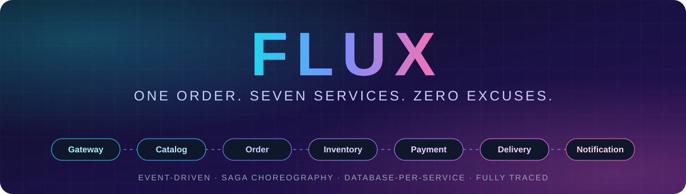
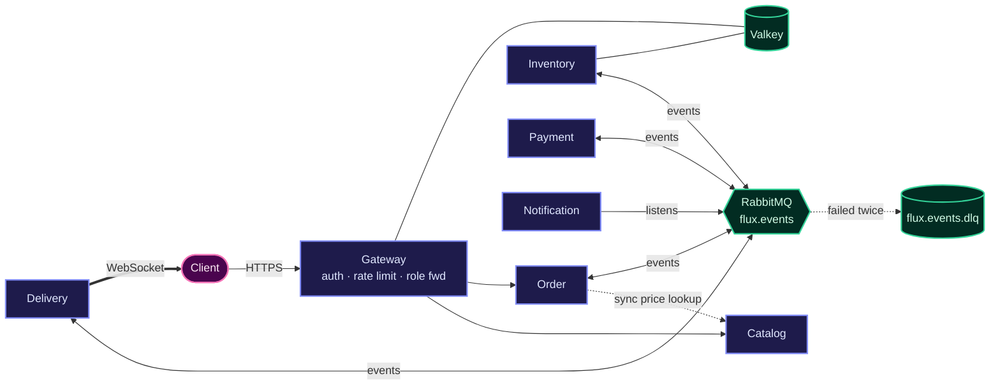
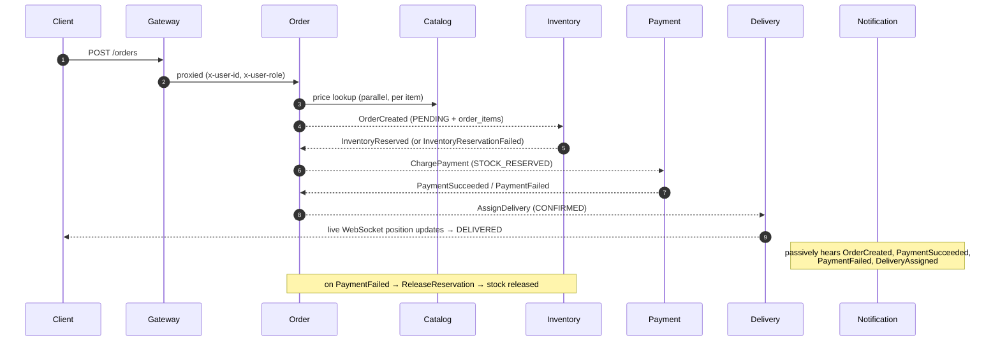

<a id="top"></a>
<div align="center">



<br/><br/>


<br/>

**[Architecture](#architecture)** &nbsp;·&nbsp; **[Quick Start](#quick-start)** &nbsp;·&nbsp; **[Testing](#testing)** &nbsp;·&nbsp; **[Hard Problems](#core-hard-problems)** &nbsp;·&nbsp; **[Roadmap](#roadmap)** &nbsp;·&nbsp; **[ADRs](#architecture-decisions)**

<br/>

<table>
  <tr>
    <td align="center" width="160"><h2>7</h2><sub>independent<br/>services</sub></td>
    <td align="center" width="160"><h2>70</h2><sub>automated<br/>tests</sub></td>
    <td align="center" width="160"><h2>76</h2><sub>spans in one<br/>connected trace</sub></td>
    <td align="center" width="160"><h2>1 / 100</h2><sub>oversell-proof<br/>under load</sub></td>
    <td align="center" width="160"><h2>0</h2><sub>shared<br/>databases</sub></td>
  </tr>
</table>

</div>

---

Flux is a distributed quick-commerce platform built as a monorepo of independent services. The goal is to model the core problems behind modern order systems — inventory reservation under concurrency, service-to-service coordination, delivery routing, and failure recovery — without a single shared database.

Most portfolio e-commerce projects are a product table, a cart, and a checkout form. Flux exists to demonstrate something different: that a single engineer can design and reason about the same category of hard problems that companies like Amazon and Flipkart solve at scale, without needing a team of thousands to prove it.

<a id="at-a-glance"></a>

## 📊 At a Glance

> [!TIP]
> New here? Read **At a Glance → Architecture → Quick Start**. Everything else is deep-dive evidence for the claims made there.

| | |
| --- | --- |
| **Services** | 7 — Gateway, Catalog, Inventory, Order, Payment, Delivery, Notification |
| **Automated tests** | 70 across all 7 services, 5 real bugs found and fixed |
| **Concurrency proof** | 100 concurrent requests vs 1 unit of stock → exactly 1 success, 99 clean conflicts (also across 3 scaled instances) |
| **Tracing** | One order = one connected trace across **7 services / 76 spans** |
| **CI** | 7 per-service GitHub Actions workflows, all green, against real Postgres / RabbitMQ / Valkey |
| **Reliability** | Dead-letter queue, rate limiting, role enforcement, real health checks |
| **Architecture decisions** | ADR-0001 through ADR-0005, accepted |
| **Up next** | Stage 5 — cart abandonment recovery, reviews, loyalty/rewards, reorder/subscriptions |

<p align="right"><sub><a href="#top">↑ back to top</a></sub></p>

---

<a id="table-of-contents"></a>

## 🧭 Table of Contents

**Overview**
- [Project Status](#project-status)
- [What Makes This Different](#what-makes-this-different)

**Design**
- [Architecture](#architecture)
- [Repository Structure](#repository-structure)
- [Services & Build Status](#services--build-status)

**Platform Features**
- [Authentication](#authentication)
- [Rate Limiting](#rate-limiting)
- [Role Enforcement](#role-enforcement)
- [Health Checks](#health-checks)
- [CI Pipeline](#ci-pipeline)
- [Multi-Instance & Scaling](#multi-instance--scaling)
- [Structured Logging & Tracing](#structured-logging--tracing)
- [Cart & Multi-Item Orders](#cart--multi-item-orders)

**Build, Run, Verify**
- [Tech Stack](#tech-stack)
- [Quick Start](#quick-start)
- [Testing](#testing)

**Planning**
- [Core Hard Problems](#core-hard-problems)
- [Roadmap](#roadmap)
- [Non-Goals (for v1)](#non-goals-for-v1)
- [Architecture Decisions](#architecture-decisions)

<p align="right"><sub><a href="#top">↑ back to top</a></sub></p>

---

<a id="project-status"></a>

## 📌 Project Status

✅ **All seven planned services are complete, and the full hardening test suite is done.** Gateway, Catalog, Inventory, Order, Payment, Delivery, and Notification are all built, dockerized, and proven working end-to-end, including the full choreographed saga (success and compensation paths), real Catalog-based pricing, geospatial nearest-driver assignment with live WebSocket tracking, event-driven customer notifications, and distributed tracing across every hop.

**Overall progress** &nbsp; `▰▰▰▰▰▰▰▰▱▱` &nbsp; **Stages 1–4 complete · Stage 5 next · deployment pending**

| Stage | Scope | Status |
| --- | --- | :---: |
| Phases 0–3 | Foundation, Inventory & Concurrency, Order Saga, Delivery & Routing | ✅ Closed |
| Phase 4 | Presentation — Notification, Gateway & Catalog suites | ✅ Done (dashboard + case study open) |
| Testing | 70 tests, 5 bugs found and fixed | ✅ Closed out |
| Stage 1 | Hardening — DLQ, rate limiting, role enforcement, health checks | ✅ Complete |
| Stage 2 | CI — per-service GitHub Actions | ✅ Complete |
| Stage 3 | Scale + observability | ✅ Complete |
| Stage 4 | Cart and multi-item orders | ✅ Complete |
| **Stage 5** | Cart abandonment recovery, reviews, loyalty/rewards, reorder/subscriptions | ⏭️ **Next** |
| Remaining | Frontend dashboard (optional, deprioritized), case study write-up, deployment | ⬜ Open |

ADR-0001 through ADR-0005 are complete and accepted. **Phases 0 through 3 are fully closed**, and Phase 2's previously-open test-coverage gaps are now closed as part of the 70-test hardening pass.

**Testing is fully closed out.** 70 automated tests pass across all 7 services, 5 real bugs were found and fixed in the process, every saga-facing gateway was refactored into named, independently testable handlers, and the full live saga — success and compensation paths — was re-verified end-to-end post-refactor, including a fixed idempotency-key scoping bug.

<details>
<summary><b>Stage 1 — Hardening</b> (all four documented reliability gaps closed)</summary>

- **Dead-letter queue.** A RabbitMQ dead-letter exchange (`flux.events.dlx` / `flux.events.dlq`) is wired into every event-consuming service — Notification, Payment, Inventory, Delivery, and Order. A message that fails processing twice is preserved with its full payload and failure metadata instead of silently discarded. Verified end-to-end with a forced-failure test, then confirmed with a full clean saga run across all 5 rebuilt services.
- **Rate limiting.** The Gateway enforces a Valkey-backed sliding-window limiter on both `/api/auth/*` (10 requests/60s) and `/orders` (30 requests/60s), keyed by client IP. Verified live: auth's limit was proven by triggering real `429`s after 10 requests, with the window state cross-checked directly against Valkey (`ZCARD`, `TTL`, `ZRANGE`); `/orders` was confirmed non-disruptive under normal traffic.
- **Role enforcement.** JWTs now carry the user's `role`, forwarded end-to-end from Gateway (`x-user-role` header) to downstream services. Catalog gates `POST`/`PATCH /products` to admin-only. Verified live: an admin token successfully creates a product; a fresh non-admin account is correctly blocked with `403 Forbidden`.
- **Real health checks.** Every service's `/health` now runs an actual `SELECT 1` against its database and, for the 5 event-driven services, checks the RabbitMQ channel is alive — returning `503` with a per-check breakdown if either is down, instead of a hardcoded `{status:"ok"}`.

</details>

<details>
<summary><b>Stage 2 — CI</b></summary>

Per-service GitHub Actions pipelines are done: each service has its own workflow (build → migrate → test) running against real, disposable Postgres/RabbitMQ/Valkey containers, triggered only on changes to that service's own path. All 7 workflows are green, with build-status badges above.

</details>

<details>
<summary><b>Stage 3 — Scale + Observability</b></summary>

The concurrency guarantee proven earlier under Vitest has been proven again under real horizontal scaling: Inventory was scaled to 3 independent instances, and the same 100-concurrent-request load test — this time hitting all 3 processes through Docker's internal load-balancing DNS, not one process's connection pool — still produced exactly 1 success and 99 clean conflicts. Scaling also exposed a real coordination bug: every instance's background job ran its own independent timer, so 3 instances meant the expiry/tracking sweep fired 3 times per interval instead of once. Fixed with `pg_try_advisory_lock` on both Inventory's expiry job and Delivery's tracking job, verified live — with 3 scaled instances and a manually expired reservation, only one instance's log line showed the sweep actually running.

Structured logging (pino) now stamps the active OpenTelemetry `traceId`/`spanId` on every log line, and both Gateway and Catalog were brought into distributed tracing (neither had it before). A single order's trace now spans all **7 services and 76 spans**, starting at the Gateway's inbound request and running through Order's price lookup into Catalog — confirmed live in Jaeger, with Catalog's spans correctly nested under Order's `GET /products/:id` call. The error-handling middleware shared across all 7 services was also cleaned up: an expected 4xx error (a bad login, a forbidden admin action) now logs exactly one structured line with no raw stack trace, while an unexpected 5xx failure still logs the full stack, tagged with `traceId`, at `error` level. See [Structured Logging & Tracing](#structured-logging--tracing).

</details>

<details>
<summary><b>Stage 4 — Cart and Multi-Item Orders</b></summary>

Orders are no longer single-product: a `PlaceOrder` request now takes a `warehouseId` and an array of `{ productId, quantity }` items, priced against Catalog in parallel, snapshotted into a new `order_items` table, and summed into `subtotal` + `shippingFee` (a free-shipping threshold) + `totalAmount` on `orders`. The riskiest part of this stage — partial compensation, where one item in a multi-item order fails to reserve after others already succeeded — is implemented in Inventory's `OrderCreated` handler: it reserves items sequentially, and if item N fails, releases every item reserved before it and publishes exactly one `InventoryReservationFailed` for the whole order. This is proven at three levels: a dedicated Vitest suite, a green CI run, and a real live Docker run (documented in [Cart & Multi-Item Orders](#cart--multi-item-orders)) showing an actual reservation created, then actually released, stock actually restored — not just logged. The equivalent happy path (both items reserved, payment charged, delivery assigned, all the way to a live driver simulation) was also verified live on the same trace.

A full, server-side, persisted cart now sits in front of checkout: `GET`/`POST /cart` and `PATCH`/`DELETE /cart/:productId`, mounted through Gateway, upsert-safe via a `(userId, productId)` unique constraint, and scoped so one user can never read or alter another's cart. Building it live (not just unit-testing it) surfaced two integration bugs invisible to either Order's own test suite or CI alone — a proxy path-stripping issue and a route-mounting collision inside Order — both fixed and documented in [Cart & Multi-Item Orders](#cart--multi-item-orders).

</details>

<details>
<summary><b>Notification Service — current mode</b></summary>

**Notification Service** listens to the same RabbitMQ exchange every other service publishes to — `OrderCreated`, `PaymentSucceeded`, `PaymentFailed`, `DeliveryAssigned` — and logs a customer-facing alert for each, idempotently (a unique constraint on `orderId` + notification type prevents duplicate alerts if an event is redelivered). It currently runs in stub mode (console + database log, same pattern as Gateway's own OTP stub mode) rather than sending real SMS; the Twilio integration itself is fully wired and ready, gated behind a single config flag, waiting only on a phone-number-resolution step that hasn't been built yet.

</details>

A frontend dashboard (optional, deprioritized), a case study write-up, and deployment remain, alongside the staged hardening/feature plan now underway — **Stage 5 (cart abandonment recovery, reviews, loyalty/rewards, reorder/subscriptions) is next.**

<p align="right"><sub><a href="#top">↑ back to top</a></sub></p>

---

<a id="what-makes-this-different"></a>

## ✨ What Makes This Different

| Principle | What it means in Flux |
| --- | --- |
| **No shared database** | Every service owns its data. No service reaches into another's tables. |
| **Event-driven, not request-chained** | Services communicate through a message broker where consistency doesn't need to be immediate, not a chain of synchronous calls that collapses the moment one link is slow. Adding a new consumer — like Notification — required touching zero existing services; it just started listening to events already flowing. |
| **Failure is a first-class case** | If payment fails after inventory succeeds, the system compensates — it doesn't leave the order in a broken half-state. Proven under genuine random failures, not just simulated on demand. Failed events themselves are no longer silently dropped either — a dead-letter queue preserves anything that fails processing across every event-consuming service, instead of discarding it after one retry. |
| **Protected at the edge** | The Gateway throttles abusive clients — brute-force login attempts, order-spam bursts — with a Valkey-backed sliding window on both `/api/auth/*` and `/orders`, rejecting excess traffic with a `429` before it can reach any downstream service. |
| **Access is scoped, not just authenticated** | A valid JWT proves who you are; it doesn't automatically grant admin actions. Role is carried in the token and enforced at the service that owns the resource (Catalog gates product writes), not just trusted blindly from a header. |
| **Health means something** | Every `/health` endpoint does a real dependency check — database and, where relevant, RabbitMQ — rather than a hardcoded 200, so a container orchestrator (or a human) can actually tell when a service is degraded. |
| **Built for quick-commerce, not generic e-commerce** | Multiple dark-store/warehouse locations, nearest-driver assignment by real distance calculation, and live delivery tracking over WebSocket. |
| **Observable by design** | A single order's journey across every service it touches — including the entry point at the Gateway and the synchronous Catalog price lookup — is visible as one connected trace, not seven separate log streams. |

<p align="right"><sub><a href="#top">↑ back to top</a></sub></p>

---

<a id="architecture"></a>

## 🏗️ Architecture

Each service owns its own PostgreSQL database. Synchronous calls are used only for two cases: Gateway's authenticated proxy, and Order's single price lookup from Catalog at placement time. Everything else — order state changes, payment confirmations, delivery assignment, live position updates, customer notifications — flows as events through RabbitMQ, or in Delivery's case, out to the browser over WebSocket.



### The full proven saga, from the Gateway inward



<details>
<summary><b>Saga walkthrough in words</b></summary>

`POST /orders` (Gateway) → Order looks up real Catalog pricing for every item in the request, in parallel, writes `PENDING` plus one `order_items` row per line item, publishes `OrderCreated` with the full items array → Inventory reserves each item's stock in sequence, atomically per item, publishes `InventoryReserved` once all items succeed (or compensates and publishes `InventoryReservationFailed` if one fails partway through — see [Cart & Multi-Item Orders](#cart--multi-item-orders)) → Order updates to `STOCK_RESERVED`, publishes `ChargePayment` with the order's real total → Payment simulates a charge, publishes `PaymentSucceeded`/`PaymentFailed` → on success, Order finalizes to `CONFIRMED` and publishes `AssignDelivery` (reusing the warehouse Inventory already reserved against) → Delivery atomically claims the nearest available driver by real Haversine distance, publishes `DeliveryAssigned` → a background simulation moves that driver toward the warehouse every 5 seconds, broadcasting live position updates over WebSocket to any subscribed client, until the delivery reaches `DELIVERED`.

Running alongside all of this, entirely passively: **Notification** hears `OrderCreated`, `PaymentSucceeded`, `PaymentFailed`, and `DeliveryAssigned` the moment they're published, and logs a corresponding customer alert for each — with no code changes required in any of the services actually producing those events.

On payment failure: Order publishes `ReleaseReservation` instead, and Inventory releases the held stock — confirmed via direct database query, independently, more than once.

</details>

### Cross-cutting design

| Concern | How it works |
| --- | --- |
| **Edge protection** | Every request entering through the Gateway passes a rate-limiting middleware backed by Valkey before it is proxied — on both `/api/auth/*` and `/orders`. Requests over the limit are rejected with `429 Too Many Requests` and never touch Order, Payment, or any other service. See [Rate Limiting](#rate-limiting). |
| **Access control** | The Gateway resolves a JWT to both a user ID and a role, forwarding both downstream as `x-user-id` and `x-user-role`. Services that need to gate specific actions — Catalog's product writes, for now — check that header directly rather than re-verifying the token. See [Role Enforcement](#role-enforcement). |
| **Transport-level failure handling** | Every event-consuming service's RabbitMQ queues are bound to a shared dead-letter exchange, `flux.events.dlx`. A message that fails processing is retried once; if it fails again, it's routed — with its original payload, routing key, and failure metadata (`x-death` headers) intact — into `flux.events.dlq`, rather than being discarded. Verified end-to-end for Notification (forced-failure test, message confirmed with intact payload and headers) and rolled out identically to Inventory, Delivery, Payment, and Order, with a full saga re-run afterward confirming no regressions. |
| **Meaningful liveness** | Every service's `/health` endpoint runs a real dependency check rather than returning a static `200`. See [Health Checks](#health-checks). |
| **Coordinated background jobs under scale** | Inventory's reservation-expiry sweep and Delivery's driver-tracking simulation both hold a Postgres advisory lock (`pg_try_advisory_lock`) for the duration of their work, so that scaling either service to multiple instances doesn't cause every instance's timer to redo the same work in parallel. Only the instance that acquires the lock does anything that cycle; the rest return immediately. See [Multi-Instance & Scaling](#multi-instance--scaling). |
| **Observable end-to-end** | Every service, including Gateway and Catalog, is now wired into OpenTelemetry + Jaeger, and every log line across every service carries the active `traceId`/`spanId` via a shared pino wrapper. A single order's full journey — Gateway's inbound request, Order's synchronous Catalog price lookup, and every async hop through the saga — renders as one connected trace. See [Structured Logging & Tracing](#structured-logging--tracing). |

See [ADR-0004](docs/adr/0004-saga-choreography.md) for the choreography-vs-orchestration reasoning, and [ADR-0005](docs/adr/0005-geospatial-routing.md) for the geospatial routing decision.

<p align="right"><sub><a href="#top">↑ back to top</a></sub></p>

---

<a id="repository-structure"></a>

## 📁 Repository Structure

A single monorepo, not seven separate repos — each service is still fully independent (own dependencies, own database, own Dockerfile), just co-located for easier solo development.

```
flux/
├── .github/
│   └── workflows/       # one CI workflow per service
├── docker-compose.yml
├── scripts/
│   └── init-databases.sh
├── docs/
│   └── adr/
├── services/
│   ├── gateway/        # auth (3 methods), routing, rate limiting, role fwd ✅ complete
│   ├── catalog/        # products, admin-gated writes                     ✅ complete
│   ├── inventory/      # stock, reservations, expiry job                  ✅ complete
│   ├── order/          # saga participant, order lifecycle                ✅ complete
│   ├── payment/        # simulated charges, idempotency                  ✅ complete
│   ├── delivery/       # nearest-driver assignment, live tracking        ✅ complete
│   └── notification/   # event-driven alerts                              ✅ complete
└── README.md
```

### Anatomy of a service

Each service follows the same shape:

```
services/<name>/
├── package.json, tsconfig.json, Dockerfile, .env, .env.docker
├── drizzle.config.ts, drizzle/            # versioned migrations, committed to git
└── src/
    ├── app.ts, server.ts
    ├── common/{config, db, dto, middleware, redis, utils, events, tracing.ts, logger.ts}/
    └── modules/<feature>/
        ├── <feature>.routes.ts       # HTTP-facing services only
        ├── <feature>.controller.ts   # HTTP-facing services only
        ├── <feature>.service.ts
        ├── <feature>.gateway.ts      # saga event subscribers/publishers
        ├── <feature>.service.test.ts # Vitest suite, co-located with the service it covers
        └── dto/
```

### Shared building blocks

- **`common/middleware/`** holds the shared `errorHandler.ts` (identical across all 7 services) alongside any service-specific middleware — Catalog's `requireAdmin`, Gateway's `isAuthenticated` and rate limiter.
- **`common/redis/client.ts`** (Gateway, Inventory) wraps the Valkey connection used for rate limiting and reservation TTLs respectively.
- **`common/events/`** (`connection.ts`, `publisher.ts`, `subscriber.ts`) wraps RabbitMQ behind a small generic API, with manual OpenTelemetry trace-context propagation built in — the publisher injects the active trace into message headers, the subscriber extracts it and wraps the handler so spans created downstream attach to the same trace, not a new disconnected one. `connection.ts` also asserts the shared dead-letter exchange (`flux.events.dlx`) and queue (`flux.events.dlq`) on connect, and `subscriber.ts`'s `assertQueue` call binds every consumer queue to it via the `x-dead-letter-exchange` argument, so a message that fails twice is preserved rather than dropped.
- **`common/tracing.ts`** is identical across all services and must load its own `dotenv/config` independently, since it runs before `server.ts` via Node's `--import` flag.
- **`common/logger.ts`** is a thin pino wrapper, identical across all 7 services: it stamps the active OpenTelemetry `traceId`/`spanId` (read via `trace.getActiveSpan()`) onto every `info`/`warn`/`error`/`debug` call, so any log line can be correlated back to its Jaeger trace. See [Structured Logging & Tracing](#structured-logging--tracing).

### Service-specific structure

- **Delivery** additionally has `common/websocket/websocket.ts` (a thin Socket.IO wrapper with per-order rooms) and `modules/deliveries/deliveries.tracking.ts` (the periodic simulation that moves an assigned driver toward the destination and broadcasts progress).
- **Notification and Payment** are both purely event-driven, with no HTTP routes at all beyond an internal `/health`.
- **Order** is the one service with two feature modules rather than one: `modules/order/` (order lifecycle, the saga driver) and `modules/cart/` (pre-checkout cart state), each with its own schema file, DTO, service, controller, routes, and test suite — kept separate because they're genuinely different concerns sharing one database, not one feature split in two for no reason. `common/db/schema.ts` re-exports both.
- **Gateway's auth module** is the one deliberate exception to the "one `.service.test.ts` per feature" convention above: its OTP flow splits `otp.service.ts` (rate-limiting, verification, session issuance) from `otp.ts` (the thin Twilio wrapper), each with its own dedicated suite — `otp.service.test.ts` and `otp.test.ts` — since mocking the Twilio call inside the service tests would leave the wrapper itself unverified. `auth.middleware.test.ts` covers the proxy-path token check separately again, since it's a request-handling concern rather than a token-issuance one.

<p align="right"><sub><a href="#top">↑ back to top</a></sub></p>

---

<a id="services--build-status"></a>

## 🧩 Services & Build Status

| Service | Status | Responsibility |
| --- | :---: | --- |
| **Gateway** | ✅ Complete | Auth (email/password, OTP, Google), request routing, token validation, rate limiting, role forwarding |
| **Catalog** | ✅ Complete | Products: create, get, list (filtered/paginated), update — writes gated to admin role |
| **Inventory** | ✅ Complete | Per-location stock, concurrency-safe reservations with timeout, background expiry job, dead-letter-backed event consumption |
| **Order** | ✅ Complete | Order lifecycle, real Catalog pricing, drives the saga through Inventory, Payment, and Delivery, dead-letter-backed events |
| **Payment** | ✅ Complete | Simulated charge outcome, idempotent via unique constraint on `idempotencyKey`, hardened event handler, dead-letter-backed |
| **Delivery** | ✅ Complete | Nearest-driver assignment (Haversine, atomically claimed), live position simulation, WebSocket broadcast, dead-letter-backed |
| **Notification** | ✅ Complete | Event-driven customer alerts on order lifecycle changes, idempotent per order+type, Twilio-ready but stubbed, dead-letter-backed |

<p align="right"><sub><a href="#top">↑ back to top</a></sub></p>

---

<a id="authentication"></a>

## 🔐 Authentication

Gateway does **not** use full OpenID Connect — that's the right tool for an external identity provider serving multiple third-party clients, not a single product's internal services. Instead, Gateway supports three login methods, all converging on one shared token-issuing function:

| Method | Details |
| --- | --- |
| **Email/password** | bcrypt-hashed, standard signup/login |
| **OTP (phone)** | Twilio-backed, rate-limited (3/hour, scoped per phone number), row-locked verification to prevent replay |
| **Google OAuth** | Implemented via direct HTTPS calls to Google's endpoints, no SDK |

All three produce the same JWT (RS256, 15-minute expiry) + opaque refresh token pair, and the JWT payload carries both `userId` and `role`. Refresh tokens are random values, hashed and stored server-side in a `sessions` table, and rotate on every use — so they can be revoked instantly, unlike a signed refresh JWT. The Gateway validates every incoming request's token before proxying it to a downstream service, and forwards the verified user's ID and role via `x-user-id` and `x-user-role` headers — services trust these headers rather than re-authenticating every call (see [Role Enforcement](#role-enforcement)). All three login paths, refresh rotation, and the proxy-path `isAuthenticated` middleware itself are covered by Vitest (see [Testing](#testing)). See [ADR-0002](docs/adr/0002-authentication-strategy.md) for the full reasoning.

<p align="right"><sub><a href="#top">↑ back to top</a></sub></p>

---

<a id="rate-limiting"></a>

## 🛡️ Rate Limiting

The Gateway throttles clients with a **Valkey-backed sliding-window limiter**, applied as middleware before requests are proxied downstream.

| Route group | Limit | Keyed by | Status |
| --- | --- | --- | --- |
| `/api/auth/*` | 10 requests / 60 seconds | Client IP | ✅ Verified live |
| `/orders` | 30 requests / 60 seconds | Client IP | ✅ Verified live |

> [!NOTE]
> OTP requests have their own separate, stricter limit (3/hour per phone number) enforced inside the OTP service — a different mechanism from the Gateway limiter described here.

### How it works

Each client gets one Valkey **sorted set** per route group (`ratelimit:<prefix>:<ip>`). On every request the limiter:

1. Removes entries older than the window (trimmed by score, i.e. timestamp).
2. Records the new request as a member with a score equal to its epoch-millisecond timestamp. The member is the timestamp plus a random suffix, so two requests landing in the same millisecond are still counted separately.
3. Counts the set (`ZCARD`). If the count exceeds the limit, the request is rejected with `429` and the standard error envelope before it reaches any downstream logic.
4. Sets a key expiry equal to the window, so idle clients' keys disappear on their own instead of accumulating.

Because state lives in Valkey rather than process memory, the limit holds across restarts and across multiple Gateway instances.

### Verified behavior

- **Auth limiter** — 12 rapid bad-password logins produced ten `401`s followed by two `429`s. Cross-checked directly in Valkey: `ZCARD` of 12, `TTL` counting down from 60, `ZRANGE ... WITHSCORES` showing one distinct timestamped entry per request.
- **Orders limiter** — 5 real authenticated requests, well under the 30/minute ceiling, all succeeded normally (`201`), confirming the limiter doesn't interfere with legitimate traffic. It uses the identical middleware and logic already proven against auth, just with a higher `max`.
- **Error envelope** on a blocked request:
  ```json
  {"status":"error","message":"Too many requests. Please try again later.","data":null}
  ```

### Known gaps

- [ ] `Retry-After` and `X-RateLimit-*` headers are not yet sent on `429` responses.
- [ ] Multi-IP isolation (one blocked client must not block another) has not been separately verified.
- [ ] No automated Vitest coverage for the rate-limiter middleware yet.
- [ ] Behind a reverse proxy or load balancer in production, every user could appear to share the proxy's IP. The Gateway needs `trust proxy` configured (e.g. `app.set('trust proxy', ...)`) so the real client IP is read from `X-Forwarded-For`. Tracked under Phase 5.

<p align="right"><sub><a href="#top">↑ back to top</a></sub></p>

---

<a id="role-enforcement"></a>

## 🔑 Role Enforcement

A valid JWT proves identity; it does not by itself grant elevated permissions. Flux carries `role` through the whole request path and enforces it at the service that owns the guarded action.

**How it flows:**

1. `generateAccessToken` signs `{ userId, role }` into the JWT (RS256) at login/refresh time.
2. Gateway's `isAuthenticated` middleware verifies the token and sets both `req.userId` and `req.userRole`.
3. The proxy layer forwards both as headers to the downstream service: `x-user-id`, `x-user-role`.
4. The downstream service enforces its own rule against that header. Catalog's `requireAdmin` middleware rejects any `POST`/`PATCH /products` request where `x-user-role !== "admin"`, returning `403 Forbidden`.

**Verified live:**

| Case | Result |
| --- | --- |
| Admin token → `POST /catalog/products` | `201`, product created |
| Fresh non-admin signup → same request | `403 Forbidden`, `"Admin access required"` |

Currently only Catalog's product writes are gated this way; other services trust `x-user-id` alone for now, since nothing else in the saga yet needs a role check.

<p align="right"><sub><a href="#top">↑ back to top</a></sub></p>

---

<a id="health-checks"></a>

## 🩺 Health Checks

Every service's `/health` endpoint performs a real dependency check instead of returning a hardcoded response.

| Service | Checks |
| --- | --- |
| Gateway, Catalog | Database only |
| Inventory, Order, Payment, Delivery, Notification | Database + RabbitMQ |

- **Database check:** `db.execute(sql\`SELECT 1\`)` — only succeeds if Postgres is actually reachable and responsive.
- **RabbitMQ check:** `getChannel()` — throws if the channel was never established or was torn down after a dropped connection.

A passing response looks like:
```json
{"status":"ok","checks":{"database":"ok","rabbitmq":"ok"}}
```

If either check fails, the endpoint returns `503` with `status: "degraded"` and a per-check breakdown showing exactly which dependency is down — verified live across all 7 rebuilt services.


<p align="right"><sub><a href="#top">↑ back to top</a></sub></p>

---

<a id="ci-pipeline"></a>

## ⚙️ CI Pipeline

Each service has its own GitHub Actions workflow under `.github/workflows/`, triggered only on pushes that touch that service's own path (`services/<name>/**`) — so an unrelated service's change never blocks or reruns a service that didn't change.

**Each workflow:**
1. Spins up real, disposable service containers for whatever that service actually depends on — Postgres always; RabbitMQ for the five event-driven services; Valkey for Gateway and Inventory (the only two that use it)
2. Checks out the code, installs dependencies, compiles TypeScript
3. Runs that service's committed Drizzle migrations against the fresh Postgres container
4. Runs the full Vitest suite against real infrastructure — no mocks for the database or broker

Gateway's workflow has one addition: since `JWT_PRIVATE_KEY`/`JWT_PUBLIC_KEY` are required config, a step generates a fresh throwaway RSA keypair with `openssl` at the start of every run and injects it as env vars for that run only — nothing is hardcoded or persisted.

| Service | CI workflow | Services provisioned |
| --- | :---: | --- |
| **Inventory** | ✅ | Postgres, RabbitMQ, Valkey |
| **Payment** | ✅ | Postgres, RabbitMQ |
| **Order** | ✅ | Postgres, RabbitMQ |
| **Delivery** | ✅ | Postgres, RabbitMQ |
| **Notification** | ✅ | Postgres, RabbitMQ |
| **Catalog** | ✅ | Postgres |
| **Gateway** | ✅ | Postgres, Valkey (+ generated JWT keypair) |

> [!IMPORTANT]
> **A real bug this caught:** Inventory's concurrency test hung indefinitely in CI until a `valkey` service container was added — `reserveStock` writes to Redis after every successful reservation, and `ioredis` doesn't fail fast on a missing connection, so all 100 concurrent test requests silently blocked forever rather than erroring. Raising the test timeout didn't fix it; the actual fix was giving CI the dependency the code genuinely needs. This is exactly the class of bug a real CI environment is meant to surface before it reaches someone else's machine.

No `lint` step yet — none of the services currently define a `lint` script; ESLint config is a candidate for a later pass.

<p align="right"><sub><a href="#top">↑ back to top</a></sub></p>

---

<a id="multi-instance--scaling"></a>

## 📈 Multi-Instance & Scaling

Flux's core concurrency guarantee — no overselling under simultaneous reservation attempts — holds not just within one process, but across multiple independent instances of the same service.

### Proven under real horizontal scaling

Inventory was scaled to 3 replicas (`docker compose up -d --scale inventory=3`), each an entirely separate Node.js process with its own connection pool and event loop. The standalone load-test script (`scripts/load-test-reservation.ts`) was then run from a throwaway container on the same Docker network, targeting `http://inventory:4002` — a hostname Docker's internal DNS round-robins across all 3 replicas rather than a single fixed instance.

| Check | Result |
| --- | --- |
| 100 concurrent reservation attempts, load-balanced across 3 processes | Exactly 1 `201`, 99 clean `409`s — identical outcome to the single-instance case |
| Source of the guarantee | The database's atomic `UPDATE ... WHERE quantity_available >= quantity`, not anything specific to one process |

This confirms the safety property is a property of the transaction, not an artifact of running as a single instance.

### The bug scaling exposed

Inventory's expiry job and Delivery's tracking job each run on a `setInterval` inside their own process. With only one instance, that's fine. With 3 replicas, all 3 instances start their own independent timer — so every interval, up to 3 separate processes would try to sweep the same expired reservations or move the same driver, relying entirely on lower-level conflict handling (a `409` catch) to paper over the collisions rather than avoiding the redundant work in the first place.

### The fix

Both jobs now acquire a **Postgres session-level advisory lock** (`pg_try_advisory_lock`) for the full duration of their work, using a dedicated connection checked out from the pool rather than a pooled one-off query — advisory locks are tied to the specific physical connection that took them, so acquiring and releasing must happen on that same connection or the lock can silently leak. Each job uses its own lock key (Inventory's expiry sweep and Delivery's tracking tick never contend with each other). An instance that fails to acquire the lock returns immediately, doing no work that cycle.

```typescript
const client = await pool.connect();
let acquired = false;
try {
  ({ rows: [{ acquired }] } = await client.query(
    "SELECT pg_try_advisory_lock($1) as acquired",
    [LOCK_KEY],
  ));
  if (!acquired) return; // another instance already has this cycle

  // ...do the actual sweep/tick work...

} finally {
  if (acquired) {
    await client.query("SELECT pg_advisory_unlock($1)", [LOCK_KEY]);
  }
  client.release();
}
```

**Verified live:** with Inventory scaled to 3 instances and a deliberately-expired `PENDING` reservation inserted directly into the database, only one instance's logs showed the sweep running:

```
inventory-2  | [expiry-job] auto-released 1 expired reservation(s)
```

`inventory-1` and `inventory-3` stayed silent for that cycle — they attempted the lock, failed to acquire it, and returned. Delivery's tracking job received the identical fix and compiled cleanly, though it hasn't been separately load-tested at scale since Delivery isn't currently run with multiple replicas in practice.

### Try it yourself

```bash
docker compose up -d --scale inventory=3
docker compose ps   # confirm 3 separate inventory containers
docker compose logs -f inventory   # watch for a single instance logging the sweep
docker compose up -d --scale inventory=1   # scale back down afterward
```

> [!NOTE]
> Inventory's `docker-compose.yml` entry has no fixed host port mapping (unlike most other services) specifically so it can be scaled — other services reach it over the Docker network at `http://inventory:4002`, which resolves correctly regardless of replica count.

<p align="right"><sub><a href="#top">↑ back to top</a></sub></p>

---

<a id="structured-logging--tracing"></a>

## 🔭 Structured Logging & Tracing

Every service logs through the same thin `common/logger.ts` pino wrapper, and every service — including Gateway and Catalog, which had neither tracing nor structured logging until this stage — is wired into OpenTelemetry + Jaeger.

### How it works

- **`common/logger.ts`** wraps pino with `info` / `warn` / `error` / `debug` methods that take `(message, extra)`. Before writing, it calls `trace.getActiveSpan()` and, if a span is active, stamps `traceId` and `spanId` onto the log line automatically — callers never pass tracing info manually.
- **`common/tracing.ts`**, identical across all 7 services, initializes OpenTelemetry and exports spans to Jaeger via OTLP. It loads before `server.ts` via Node's `--import` flag, and reads `SERVICE_NAME` / `OTEL_EXPORTER_OTLP_ENDPOINT` from its own `dotenv/config` call, since it runs before the app's own env loading.
- Gateway and Catalog previously had no tracing at all. Both now have the full package: `common/tracing.ts`, the OpenTelemetry dependencies, the `--import` start/dev scripts, the required env vars, and a `jaeger` entry in `depends_on`.
- **`common/middleware/errorHandler.ts`**, identical across all 7 services, is the single place every unhandled error terminates. It resolves a status and message once, then logs exactly one structured line: `logger.warn` (no stack) for an expected 4xx, `logger.error` (with the full `err` object, stack included) for an unexpected 5xx. Nothing calls `console.error` on the request path anymore.

### Verified live

An order's trace now starts at the Gateway's `POST /orders` span and runs, uninterrupted, through Order's synchronous Catalog price lookup and every asynchronous hop of the saga:

```
gateway POST → order POST → order GET (60.87ms) → catalog GET (47.86ms)
                                                    → catalog request handler /products/:id
                                                        → pg-pool.connect (21.68ms)
                                                        → pg.query SELECT (13.83ms)
```

The trace header reports **7 services, 76 spans** (up from 6 services / 68 spans before Gateway and Catalog joined). The `url.full` tag on Order's span shows the real outbound call (`http://catalog:4001/products/...`), confirming Order is genuinely calling Catalog over the network rather than the trace being stitched together artificially. About 22ms of Catalog's response time is a fresh Postgres connection being opened (`pg.connect`, including its own `tcp.connect`/`dns.lookup`); `pg`'s default pool closes idle connections after 10 seconds, so a lightly used service like Catalog pays that setup cost on its next request — a cost that's invisible without a trace.

A bad-password login and a non-admin write both produce a single clean log line from `errorHandler.ts`, with no raw stack trace, correctly correlated by `traceId` to the request's other log lines (e.g. the controller's own "login failed" or "admin access denied" log):

```json
{"level":40,"traceId":"7b011dc0...","status":401,"method":"POST","path":"/api/auth/login","msg":"Invalid email or password"}
{"level":40,"traceId":"bffc7815...","userId":"...","role":"user","method":"POST","path":"/products","msg":"admin access denied"}
{"level":40,"traceId":"bffc7815...","status":403,"method":"POST","path":"/products","msg":"Admin access required"}
```

### Try it yourself

```bash
docker compose up -d --build
curl -X POST http://localhost:4000/api/auth/login -H "Content-Type: application/json" -d '{"email":"a@b.com","password":"wrong"}'
docker compose logs gateway --tail 20
```

Then open `http://localhost:16686`, search under the `gateway` service, and open the most recent trace — it should start at the Gateway's inbound request and span all 7 services.

<p align="right"><sub><a href="#top">↑ back to top</a></sub></p>

---

<a id="cart--multi-item-orders"></a>

## 🛒 Cart & Multi-Item Orders

An order is no longer one product. `PlaceOrder` takes a `warehouseId` and an array of `{ productId, quantity }` items; a server-side, persisted cart (`cart_items`) sits in front of checkout so a future cart-abandonment-recovery job has something real to look at.

### Schema

| Table (DB) | Notes |
| --- | --- |
| **`cart_items`** (Order's DB) | `userId`, `productId`, `quantity`. No price column, by design: the cart never stores or trusts a price, so there's nowhere for a stale one to hide. A unique constraint on `(userId, productId)` makes "add to cart" a safe upsert instead of creating duplicate rows. |
| **`order_items`** (Order's DB, new) | One row per line item, with `unitPrice` **snapshotted from Catalog at checkout**, never re-derived later. Foreign-keyed to `orders.id`. |
| **`orders`** | `productId`/`quantity`/`reservationId` removed (an order can no longer point at one product or one reservation); `subtotal`, `shippingFee`, and `totalAmount` added. `shippingFee` is `0` once `subtotal` clears a configurable free-shipping threshold, otherwise a flat fee. |
| **`reservations`** (Inventory's DB) | Already one row per `(orderId, productId)`, so no shape change was needed for multi-item orders; a unique constraint on that pair was added as a safety net against duplicate reservations from a redelivered event. |

### The checkout flow

`POST /orders` fetches each item's real price from Catalog in parallel, computes `subtotal`/`shippingFee`/`totalAmount` server-side (the client never sends a price), and inserts the `orders` row plus every `order_items` row in a single `db.transaction` — an order is never left with missing line items. `OrderCreated` now carries the full `items` array instead of one product.

Every reservation-related event contract was simplified in the process: **`InventoryReserved`, `InventoryReservationFailed`, and `ReleaseReservation` all carry just `{ orderId }`, with no reservation ID at all.** Order never tracked which specific reservations existed — it only ever needed to say "this order succeeded" or "this order failed." Inventory owns the reservation details entirely, including looking up and releasing every reservation for an order by `orderId` when asked. Payment's idempotency key changed from a per-reservation ID to the order's own ID, which is simpler and more correct: it's the *order* that must not be double-charged, not any particular reservation underneath it.

### Partial compensation — the riskiest part of this stage

If item 1 of 2 reserves successfully and item 2 has insufficient stock, Inventory's `OrderCreated` handler releases item 1's reservation before publishing a single `InventoryReservationFailed` for the whole order — the customer never ends up with half an order silently holding stock. Items are reserved **sequentially, not in parallel**, specifically so the handler always knows exactly which reservations exist to roll back at the moment a later one fails. If a release itself fails during compensation, it's logged and the loop continues rather than aborting, so one bad release can't leave every other item's stock stuck held.

This path is proven at three levels, not just implemented and assumed correct:

**1. Unit test** — seeds one product with stock and one without, calls the handler directly, and asserts the first item's reservation ends as `RELEASED` (not left `PENDING`), the second item never got a reservation row at all, stock counters are back to their original values, and `InventoryReservationFailed` fired exactly once while `InventoryReserved` never did.

**2. CI** — the same test runs against a real disposable Postgres/RabbitMQ pair on every push; Inventory's workflow is green.

**3. Live, end-to-end, in Docker** — an actual multi-item order was placed with one product in stock and one without. The logs show the real sequence:

```
{"msg":"item reserved","productId":"8ac6fe5d...","reservationId":"36475f27..."}
{"msg":"insufficient stock for item, compensating","productId":"1ef965e9..."}
[rabbitmq] published event: InventoryReservationFailed
```

Querying the database directly afterward confirmed the reservation was genuinely rolled back, not just logged as if it were:

```
 product_id                            | status
----------------------------------------+----------
 8ac6fe5d-9f5f-4f6a-ab68-3bae630b2d06   | RELEASED

 quantity_available | quantity_reserved
---------------------+--------------------
                  10 |                  0
```

### The happy path, also verified live

The same request, with both items in stock, was run end-to-end on a single trace: both items reserved → `InventoryReserved` → `STOCK_RESERVED` → `ChargePayment` (`idempotencyKey` equal to the order's own ID) → `PaymentSucceeded` → `CONFIRMED` → `AssignDelivery` → a driver assigned and the live tracking simulation running through to arrival — with Notification firing a correctly-ordered customer alert at every stage along the way, all sharing the same `traceId`.

### Cart endpoints

`cart_items` is no longer just a table waiting for a consumer — the full CRUD surface is live, mounted through Gateway at `/cart`:

| Method | Path | Behavior |
| --- | --- | --- |
| `GET` | `/cart` | Returns all items for the authenticated user (an empty array for an empty cart, not an error) |
| `POST` | `/cart` | Adds a product; if it's already in the cart, **increments** the existing quantity via a single atomic `INSERT ... ON CONFLICT DO UPDATE` rather than a check-then-write |
| `PATCH` | `/cart/:productId` | Sets quantity to an exact value (not additive) |
| `DELETE` | `/cart/:productId` | Removes the item |

Every mutation is scoped to `(userId, productId)` in its `WHERE` clause — update and remove both return a clean `404` if the product isn't in *that user's* cart, and a dedicated test proves user A cannot alter user B's cart row even by guessing a `productId`. `addToCart`'s upsert reuses the same unique constraint `cart_items` was built with, so adding the same product twice never risks the check-then-insert race condition `reserveStock` was designed to avoid.

**Two real integration bugs were caught here, neither visible from unit tests alone:**

1. **Gateway's proxy strips the mount path before forwarding.** `app.use("/cart", proxyTo(...))` meant Order received a bare `/`, not `/cart` — which happened to work for `/orders` (mounted at root in Order) but broke `/cart` (mounted at `/cart` in Order) silently. Fixed by giving `proxyTo` an optional second argument that re-adds the stripped prefix via `pathRewrite`, used only where the downstream service actually expects it.
2. **A route-ordering collision inside Order.** `orderRoutes` was mounted at `/` with a `GET /:id` wildcard, registered *before* `cartRoutes`. A `GET /cart` request matched that wildcard first (`id = "cart"`), reached `orders.service.ts`, and crashed on `invalid input syntax for type uuid: "cart"` before Express ever reached `cartRoutes`. Fixed by mounting `cartRoutes` before `orderRoutes`.

Both were only caught because every cart operation was tested through the real Gateway → Order path, not just against Order's own test suite — exactly the gap unit tests and even CI can't close on their own.

### Known gaps

- [ ] Catalog has no batch price-lookup endpoint yet, so an *n*-item order makes *n* parallel price-lookup calls rather than one batched call. Acceptable for now; worth revisiting alongside Stage 7's real search/recommendations work, which wants batch product lookups too.
- [ ] `getOrderById` still returns only the `orders` row, not its `order_items` — fine for the saga, but a customer-facing order-detail response will need a join.
- [ ] Cart items aren't validated against Catalog at add-to-cart time — a nonexistent `productId` can sit in a cart silently; checkout is still the single source of truth that catches it (`placeOrder` already 400s on an unknown product).

<p align="right"><sub><a href="#top">↑ back to top</a></sub></p>

---

<a id="tech-stack"></a>

## 🧰 Tech Stack

| Layer | Technology | Purpose |
| --- | --- | --- |
| **Language** | TypeScript (strict, ESM/nodenext) | Type-safe code across all services |
| **Runtime** | Node.js 20, Express 5 | Per-service HTTP APIs |
| **Database** | PostgreSQL (one per service), Drizzle ORM | Durable, service-owned data, versioned migrations committed to git |
| **Cache / Locking** | Valkey (Redis-compatible) | Stock reservation TTLs, distributed locks, sliding-window rate limiting |
| **Event Broker** | RabbitMQ (topic exchange `flux.events`, dead-letter exchange `flux.events.dlx`) | Async communication between services, with failure preservation |
| **Real-time** | Socket.IO | Live delivery position updates per order (room-scoped) |
| **Tracing** | OpenTelemetry + Jaeger | End-to-end request tracing, manually propagated across RabbitMQ, across all 7 services |
| **Logging** | pino, with a shared trace-correlating wrapper (`common/logger.ts`) | Structured, per-request logs correlated to their Jaeger trace via `traceId` |
| **Auth** | JWT (RS256, carries role), bcrypt, Twilio, Google OAuth2 (raw HTTPS) | Multi-method authentication + role-based authorization |
| **Notifications** | Twilio (stubbed pending phone-lookup wiring) | Event-driven customer alerts |
| **Validation** | Zod + BaseDto pattern | Schema-based DTO validation |
| **Testing** | Vitest | Unit and integration tests, co-located per service — 70 tests across all 7 services |
| **CI** | GitHub Actions, one workflow per service | Build + migrate + test against real disposable infra on every push |
| **Dev Tooling** | Docker Compose, tsc-watch | Local multi-service infrastructure |

<p align="right"><sub><a href="#top">↑ back to top</a></sub></p>

---

<a id="quick-start"></a>

## 🚀 Quick Start

### 1. Start everything

```bash
docker compose up -d --build
docker compose ps
```

Confirm all containers (Postgres, Valkey, RabbitMQ, Jaeger, and all seven services) show `Up`.

> [!TIP]
> If you're rebuilding after changing source (not just config), `docker compose up -d --build` can reuse an already-running container instead of replacing it — run `docker compose down` first, then `docker compose build --no-cache <service>` and `docker compose up -d`, if you need to guarantee a clean rebuild.

### 2. Verify

```bash
curl http://localhost:4000/health
```

Expect `{"status":"ok","checks":{"database":"ok"}}`.

### 3. Exercise the full saga

```bash
curl -X POST http://localhost:4000/orders \
  -H "Authorization: Bearer <token>" \
  -H "Content-Type: application/json" \
  -d '{
    "warehouseId": "...",
    "items": [
      { "productId": "...", "quantity": 2 },
      { "productId": "...", "quantity": 1 }
    ]
  }'
```

An order can carry one item or several — `items` just needs at least one entry. Watch `docker compose logs -f order inventory payment delivery notification` to see the event chain fire in real time, including Notification's alerts at each stage. Payment simulates a charge with a ~90% success rate; on success, the saga continues all the way to a driver assignment and live tracking. If any item in the request has insufficient stock, Inventory releases everything already reserved for that order and the saga fails cleanly instead of leaving a half-reserved order — see [Cart & Multi-Item Orders](#cart--multi-item-orders).

### 4. Watch live delivery tracking

Connect a Socket.IO client to `http://localhost:4005`, emit `subscribe` with the order's ID, and listen for `delivery:update` events — a new one arrives roughly every 5 seconds until the delivery reaches `DELIVERED`.

### 5. Inspect a trace

Open `http://localhost:16686`, search under the `gateway` service, and open the most recent trace — it should span all 7 services, starting at the Gateway's inbound request. See [Structured Logging & Tracing](#structured-logging--tracing).

### 6. Inspect the dead-letter queue

Open the RabbitMQ management UI at `http://localhost:15672` (default `guest`/`guest`), go to **Queues**, and open `flux.events.dlq` — any event that failed processing twice will be sitting there with its original payload and an `x-death` header showing which queue and exchange it came from.

### 7. Watch the rate limiter

Send a burst of requests to `/api/auth/login` and inspect the resulting window with `valkey-cli --scan --pattern "ratelimit:*"`. Keys expire 60 seconds after the last request, so inspect them right after the burst.

### 8. Test role enforcement

Promote a user to admin directly in the database (`UPDATE users SET role = 'admin' WHERE email = '...'`), log in fresh to get a token carrying the new role, then try `POST /catalog/products` with and without that role — expect `201` and `403` respectively.

### Environment files

Each service has two env files: `.env` (uses `localhost`, for local tooling) and `.env.docker` (uses the Docker service name as the hostname, for containers) — `docker compose` reads the latter automatically.

<p align="right"><sub><a href="#top">↑ back to top</a></sub></p>

---

<a id="testing"></a>

## 🧪 Testing

Each service that owns non-trivial logic carries a Vitest suite, co-located next to the code it covers (`<feature>.service.test.ts`), run per-service with:

```bash
cd services/<name>
npm test
```

| Service | Suites | Focus |
| --- | :---: | --- |
| **Gateway** | 5 | Email/password, OTP, Google OAuth, shared token issuance, proxy-path token validation |
| **Inventory** | 2 | Zero-oversell concurrency, background expiry job, multi-item partial-compensation (and its happy-path counterpart) |
| **Payment** | 1 | Idempotency, scoped by key vs. by order |
| **Order** | 2 | Real-pricing derivation, saga handler correctness across all four handlers, cart upsert/scoping/empty-cart behavior |
| **Delivery** | 1 | Concurrent claim, transaction rollback, nearest-driver selection |
| **Notification** | 1 | Idempotency per order + notification type |
| **Catalog** | 1 | Product creation, lookup, filtering, pagination, updates, and price precision |

**70 tests total across all 7 services, with 5 real bugs found and fixed** during the process — every saga-facing gateway was refactored into named, independently testable handlers along the way, and the full live saga (success and compensation paths) was re-verified end-to-end post-refactor, including a fixed idempotency-key scoping bug.

Run every service's suite from the repo root with:

```bash
for d in services/*/; do (cd "$d" && npm test); done
```

(PowerShell equivalent: `Get-ChildItem services -Directory | ForEach-Object { npm test --prefix $_.FullName }`)

### What each suite proves

<details>
<summary><b>Gateway</b> — the most thoroughly covered service (5 suites)</summary>

Five suites spanning all three login methods, the shared token machinery, and the request-facing side of auth:

- `auth.service.test.ts` (email/password + refresh) — signup creates the user and email identity, duplicate emails are rejected, login returns both tokens and rejects bad credentials with the _same_ message as an unknown email to prevent account enumeration, refresh rotates and invalidates the previous token, and sessions receive the expected ~7-day expiry.
- `otp.service.test.ts` — rate-limiting at 3/hour scoped per phone number rather than globally, codes stored only as a hash — never in plaintext, new-user creation vs. existing-user reuse across repeat logins, and rejection of wrong, expired, already-consumed, and never-requested codes.
- `google-auth.service.test.ts` — the authorization URL's params, both of Google's HTTP calls succeeding and failing correctly, new-user creation vs. existing-identity reuse on repeat login, and that a failed token exchange or profile fetch never leaves a stray user row behind.
- `otp.test.ts` — the Twilio wrapper in isolation: stub mode logs to console and skips Twilio entirely, live mode sends the exact expected payload, and a Twilio-side failure propagates instead of being silently swallowed.
- `auth.middleware.test.ts` — the `isAuthenticated` proxy-path check itself: a valid token sets `req.userId` and calls through cleanly, a missing or malformed `Authorization` header is rejected with a 401 rather than crashing, and a thrown verification error, such as an expired token, is correctly forwarded to the error handler instead of swallowed.

</details>

<details>
<summary><b>Inventory</b> — concurrency safety and partial compensation</summary>

Concurrency safety is proven with a real 100-concurrent-request test against 1 unit of stock: exactly 1 reservation succeeds, 99 are cleanly rejected with a conflict, and none of the 99 fail for an unrelated reason. The same scenario is also exercised as a standalone load-test script (`scripts/load-test-reservation.ts`) that hits a running instance directly over HTTP, independent of the Vitest suite, so the guarantee is checked both at the unit level and against the real running service.

A separate suite covers the multi-item `OrderCreated` handler directly: one test seeds one product with stock and one without, and confirms the in-stock item's reservation is explicitly released (not left `PENDING`) and stock is fully restored when a later item fails; a companion test confirms both items reserve and `InventoryReserved` fires exactly once when every item has stock. See [Cart & Multi-Item Orders](#cart--multi-item-orders) for this same scenario verified live in Docker, not just under Vitest.

</details>

<details>
<summary><b>Payment</b> — idempotency</summary>

Idempotency is proven with three cases: the same `idempotencyKey` called twice returns the same payment row and the same outcome rather than re-rolling a fresh charge result, while a different `idempotencyKey` against the same `orderId` correctly creates a second, independent payment row — confirming the unique constraint is scoped to the key, not the order, so a legitimate retry after a failed attempt isn't blocked.

The event handler (`handleChargePayment`) itself has also been hardened: a validation failure now publishes a compensating `PaymentFailed` instead of silently dropping the event, and a thrown error from `chargePayment` is now caught and handled rather than left unguarded.

</details>

<details>
<summary><b>Order</b> — pricing, saga handlers, cart</summary>

Pricing is tested against a mocked Catalog response for both a single item (catching a real rounding bug where `.toFixed()` with no argument silently collapsed `99.98` to `100`) and multiple different-priced items (confirming `subtotal` sums correctly and each item lands in `order_items` with its own snapshotted price); a Catalog-unreachable case confirms a clean error instead of an unhandled network exception; and all four saga handlers — `InventoryReserved`, `InventoryReservationFailed`, `PaymentSucceeded`, and `PaymentFailed` — are tested as actually-imported, directly-called functions (not a re-statement of their own inputs), confirming `InventoryReserved` uses the order's own ID as Payment's idempotency key — stable across a redelivery of the same event, unlike the earlier per-reservation key it replaced.

A second suite covers the cart module: `addToCart`'s upsert increments an existing row's quantity rather than creating a duplicate; `updateCartItemQuantity` sets an exact value rather than adding to it; both `updateCartItemQuantity` and `removeFromCart` throw a clean not-found for a nonexistent item and, critically, for an item that exists but belongs to a different user — proving the scoping, not just the happy path; and `getCart` returns an empty array rather than an error for a user with nothing in their cart.

</details>

<details>
<summary><b>Catalog</b> — 12 tests</summary>

The 12-test suite covers product creation with exact two-decimal price storage, lookup of existing and nonexistent products, unfiltered and category-filtered listing, pagination across multiple pages, empty filter results, partial updates that preserve unspecified fields, price updates without floating-point corruption, and not-found handling for updates.

</details>

<details>
<summary><b>Delivery</b> — concurrent claim, rollback, nearest driver</summary>

The same concurrency pattern as Inventory is applied to driver assignment: 10 concurrent requests against 1 available driver yield exactly 1 success. A second test specifically proves the transaction boundary works — if the delivery record fails to insert after a driver is claimed, the claim itself rolls back, leaving the driver `AVAILABLE` rather than permanently stranded as `BUSY`. A third test seeds two drivers at different distances and confirms the nearer one is actually selected, not just the first one found.

</details>

<details>
<summary><b>Notification</b> — idempotency</summary>

Idempotency is backed by a database-level unique constraint on `(orderId, type)`, confirmed both for repeated calls to the same event type and for a genuine redelivery of the same `PaymentSucceeded` event; a separate case confirms different notification types for the same order are correctly treated as independent, non-duplicate rows.

</details>

### Reliability verification (beyond unit/integration tests)

| Area | Verification |
| --- | --- |
| **Dead-letter queue** | Verified end-to-end for Notification via a forced-failure test: a handler was made to throw deliberately, the message was retried once, failed again, and was confirmed sitting in `flux.events.dlq` with its full original payload and an `x-death` header showing the originating queue, exchange, and rejection reason. The identical wiring was then rolled out to Inventory, Delivery, Payment, and Order, with a full saga re-run afterward confirming zero regressions in the happy path. |
| **Rate limiting** | See [Rate Limiting](#rate-limiting) above for the full live-verification breakdown of both `/api/auth/*` and `/orders`. |
| **Role enforcement** | See [Role Enforcement](#role-enforcement) above for the admin/non-admin live test. |
| **Health checks** | See [Health Checks](#health-checks) above; all 7 services confirmed returning real `200`/`503` based on actual dependency state. |
| **CI** | See [CI Pipeline](#ci-pipeline) above; all 7 workflows are green, running the full suite against real service containers on every push. |
| **Structured logging & tracing** | See [Structured Logging & Tracing](#structured-logging--tracing) above; all 7 services confirmed emitting trace-correlated structured logs, with a single order's trace spanning all 7 services / 76 spans in Jaeger. |
| **Multi-item partial compensation** | See [Cart & Multi-Item Orders](#cart--multi-item-orders) above for the full live-verification breakdown: a real reservation created and then genuinely released (confirmed by direct database query, not just logs), stock restored, exactly one failure event published — plus the equivalent happy path proven on the same trace, end to end through to delivery. |

<p align="right"><sub><a href="#top">↑ back to top</a></sub></p>

---

<a id="core-hard-problems"></a>

## 🧠 Core Hard Problems

| # | Problem | How Flux solves it | Proof | Service(s) |
| :-: | --- | --- | --- | --- |
| 1 | **Zero overselling under concurrency** | Atomic reservation with timeout; a background job auto-releases abandoned reservations | 100 concurrent requests against 1 unit of stock, exactly 1 success; expiry job also proven live | Inventory — complete |
| 2 | **The order saga** | Order placed → inventory reserved → payment charged → delivery assigned → customer notified. A failed event is no longer a silent one — it's preserved for inspection and replay rather than discarded, across every service in the saga | Success and compensation paths proven live in Docker, with real pricing and real geospatial assignment throughout, and distributed tracing showing every hop — from the Gateway's inbound request onward — as one connected trace | Order / Inventory / Payment / Delivery / Notification — complete; dead-letter preservation verified across all five |
| 3 | **Nearest-driver routing with live tracking** | The closest available driver to the shipping warehouse is selected using real Haversine distance calculation, claimed atomically to prevent double-booking under concurrent assignment, and their simulated movement is broadcast live to any client watching that order | Verified end-to-end with a continuous stream of position updates ending in a correct `DELIVERED` state | Delivery — complete |
| 4 | **Abuse protection and access control at the edge** | A distributed sliding-window limiter in Valkey rejects excess requests before they reach any service, and role is carried through the request path so a valid login alone doesn't grant admin actions | Both verified live | Gateway / Catalog |
| 5 | **Correctness under horizontal scaling** | The same zero-oversell guarantee holds when the guaranteeing service is scaled to multiple independent processes, and background jobs coordinate via a Postgres advisory lock so scaling never causes duplicate work | Verified live | Inventory — verified live; Delivery has the identical fix applied |
| 6 | **Observability across service boundaries** | A single order's journey, including the synchronous Gateway → Order → Catalog hop, is visible as one connected trace across all 7 services, and every log line anywhere in the system can be correlated back to that trace by `traceId` | Verified live, 76 spans per order | All 7 services |
| 7 | **Partial failure inside a single order** | A multi-item order where one item can't be reserved doesn't fail atomically or leave the others silently held: Inventory reserves sequentially, rolls back everything already reserved the moment one item fails, and reports exactly one outcome for the whole order | Verified at the unit-test, CI, and live-Docker level; see [Cart & Multi-Item Orders](#cart--multi-item-orders) | Order / Inventory |

<p align="right"><sub><a href="#top">↑ back to top</a></sub></p>

---

<a id="roadmap"></a>

## 🗺️ Roadmap

### Phase 0 — Foundation

- [x] Repo structure, Docker Compose infra
- [x] Gateway with full 3-method authentication
- [x] Catalog service, tested through Gateway's proxy

### Phase 1 — Inventory & Concurrency

- [x] Atomic reservation with timeout, proven zero-oversell under 100 concurrent requests (Vitest + standalone load test)
- [x] Background expiry job, verified live
- [x] [ADR-0003](docs/adr/0003-concurrency-approach.md) accepted

### Phase 2 — Order Saga

- [x] Order and Payment services built
- [x] Success and compensation paths proven live, multiple times
- [x] Real Catalog-based pricing, verified end-to-end (including a caught-and-fixed rounding bug)
- [x] Payment idempotency proven under Vitest (same key → same outcome; different key → independent charge)
- [x] Full test coverage across all four Order saga handlers
- [x] Payment's inbound event handler hardened against silently-dropped validation failures
- [x] Distributed tracing across the full saga, verified as one connected trace
- [x] [ADR-0004](docs/adr/0004-saga-choreography.md) accepted

### Phase 3 — Delivery & Routing

- [x] Warehouse/driver/delivery model
- [x] Nearest-available-driver assignment via Haversine, atomically claimed
- [x] Live delivery tracking over WebSocket, backed by a real simulation job
- [x] [ADR-0005](docs/adr/0005-geospatial-routing.md) accepted

### Phase 4 — Presentation

- [x] Notification Service — event-driven, idempotent, Twilio-ready (stubbed pending phone lookup)
- [x] Gateway test suite completed across all three login methods (email/password, OTP, Google OAuth), refresh rotation, and the proxy-path auth middleware
- [x] Catalog test suite completed: 12 tests covering product creation, lookup, filtering, pagination, updates, and price precision
- [ ] Minimal dashboard showing live order flow and delivery tracking (optional, deprioritized)
- [ ] Case study write-up

### Phase 4.5 — Hardening

- [x] Full automated test suite: 70 tests across all 7 services, 5 real bugs found and fixed
- [x] Dead-letter queue for RabbitMQ — rolled out and verified across all 5 event-consuming services
- [x] Rate limiting at Gateway on `/api/auth/*` (10/60s) and `/orders` (30/60s) — both verified live
- [x] Role enforcement — JWT carries role, Gateway forwards `x-user-role`, Catalog gates admin-only product writes — verified live
- [x] Real health checks — every `/health` pings DB (+ RabbitMQ where relevant), returns 503 if either is down — verified across all 7 services
- [x] CI pipeline per service (GitHub Actions: build → migrate → test, against real Postgres/RabbitMQ/Valkey) — all 7 workflows green
- [x] README build-status badges (per-service)
- [x] Multi-instance proof + advisory-lock fix for background jobs — Inventory scaled to 3 replicas, 100-request load test re-verified across processes, expiry/tracking jobs now advisory-lock-coordinated so only one instance runs per cycle
- [x] Structured logging (pino) with OpenTelemetry trace correlation — rolled out across all 7 services, Gateway and Catalog additionally brought into tracing for the first time
- [x] Shared `errorHandler.ts` cleaned up across all 7 services — single structured log line per error, no raw stack trace on expected 4xx errors
- [ ] `Retry-After` and `X-RateLimit-Limit` / `-Remaining` / `-Reset` headers on `429` responses
- [ ] Multi-IP isolation check for the rate limiter (one blocked client must not block another)
- [ ] Automated Vitest coverage for the rate-limiter middleware
- [ ] Remove `X-Powered-By: Express` from responses (`app.disable('x-powered-by')` or `helmet()`)
- [ ] Add a `lint` script (ESLint) per service and wire it into CI

### Stage 4 — Cart Foundation

- [x] `cart_items` table (server-side, persisted, upsert-safe via a `(userId, productId)` unique constraint)
- [x] `order_items` table, with `unitPrice` snapshotted from Catalog at checkout
- [x] `orders` schema updated — single-product columns removed, `subtotal`/`shippingFee`/`totalAmount` added
- [x] `PlaceOrder` accepts multiple items, prices them in parallel against Catalog, inserts the order and its line items in one transaction
- [x] Free shipping threshold, computed alongside `subtotal`
- [x] `OrderCreated`, `InventoryReserved`, `InventoryReservationFailed`, and `ReleaseReservation` event contracts simplified to carry `orderId` only — no reservation IDs tracked by Order
- [x] Payment idempotency key changed from a per-reservation ID to the order's own ID
- [x] Partial-compensation logic in Inventory's `OrderCreated` handler — sequential per-item reservation, full rollback of already-succeeded items on a later failure, exactly one failure event per order
- [x] Dedicated Vitest coverage for the partial-compensation path, plus a happy-path multi-item test
- [x] CI green for both Order and Inventory against the new schema
- [x] Full saga proven live in Docker for both the failure path (one item released, stock restored, confirmed by direct DB query) and the happy path (both items reserved, paid, delivered, tracked live) — see [Cart & Multi-Item Orders](#cart--multi-item-orders)
- [x] Cart endpoints (`GET`/`POST /cart`, `PATCH`/`DELETE /cart/:productId`) — upsert-safe add, exact-set update, user-scoped on every mutation, dedicated Vitest coverage, and verified live end-to-end through the real Gateway → Order path
- [x] Two integration bugs found and fixed during live cart testing: Gateway's proxy stripping the `/cart` mount path before forwarding, and a route-mounting collision in Order where `orderRoutes`' `GET /:id` wildcard swallowed `/cart` requests before `cartRoutes` could match them
- [ ] Catalog batch price-lookup endpoint — Order currently makes one parallel call per item

### Stage 5 — Next

- [ ] Cart abandonment recovery
- [ ] Reviews
- [ ] Loyalty / rewards
- [ ] Reorder / subscriptions

### Phase 5 — Deployment

- [ ] Managed infra swap (Neon, Upstash, CloudAMQP)
- [ ] Production env vars, CI/CD per service (CI built in Phase 4.5; CD/deploy step lands here)
- [ ] Configure Express `trust proxy` on the Gateway so rate limiting keys on the real client IP behind a load balancer
- [ ] Network isolation — remove public ports from every internal service except Gateway
- [ ] Post-deploy verification of the full saga in production

<p align="right"><sub><a href="#top">↑ back to top</a></sub></p>

---

<a id="non-goals-for-v1"></a>

## 🚫 Non-Goals (for v1)

- Seller/marketplace onboarding
- Full admin back-office and analytics dashboards
- Native mobile apps
- Internationalization / multi-currency

Recommendations, real search, and multi-warehouse stock selection are deferred to a later stage of the roadmap above rather than ruled out for v1.

<p align="right"><sub><a href="#top">↑ back to top</a></sub></p>

---

<a id="architecture-decisions"></a>

## 📚 Architecture Decisions

| ADR | Decision |
| --- | --- |
| [ADR-0001](docs/adr/0001-database-selection.md) | Database-per-service vs shared database |
| [ADR-0002](docs/adr/0002-authentication-strategy.md) | Authentication strategy |
| [ADR-0003](docs/adr/0003-concurrency-approach.md) | Concurrency strategy for inventory reservation |
| [ADR-0004](docs/adr/0004-saga-choreography.md) | Saga pattern — choreography vs orchestration |
| [ADR-0005](docs/adr/0005-geospatial-routing.md) | Geospatial routing approach |

---

<div align="center">

_A masterpiece isn't the one with the most features. It's the one where every piece exists on purpose._

</div>